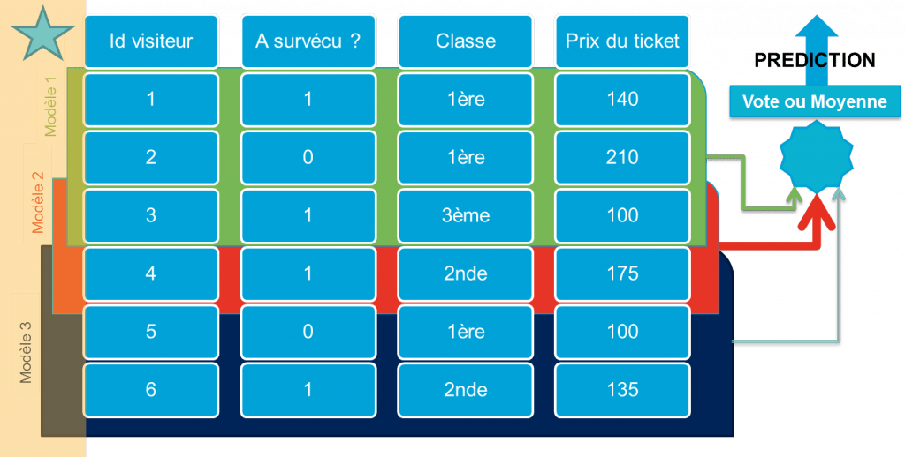

# Ensemble Learning: Bagging Boosting Stacking

Python Machine Learning en français vous enseigne les techniques d'Ensemble Learning : Bagging Boosting et Stacking, qui permettent de développer les modèles de machine learning les plus puissants au monde, comme l'algorithme de Random Forest.

## Ensemble Learning
En statistique et en apprentissage automatique, l'apprentissage ensembliste utilise plusieurs algorithmes d'apprentissage pour obtenir de meilleures prédictions.

Par exemple  l'ensemble de méthodes **bagging**, **boosting** et les **forêts aléatoires** est un exemple d'apprentissage ensembliste.

## Bagging
Le **bootstrap aggregating**, également appelé **bagging** (de bootstrap aggregating), est un meta-algorithme d'apprentissage ensembliste conçu pour améliorer la stabilité et la précision des algorithmes d'apprentissage automatique. Il réduit la variance et permet d'éviter le surapprentissage. Bien qu'il soit généralement appliqué aux méthodes d'arbres de décision, il peut être utilisé avec n'importe quel type de méthode. Le bootstrap aggregating est un cas particulier de l'approche d'apprentissage ensembliste.

* Exemple 
Avec Scikit-learn, il est simple de produire de tels modèles baggés, par exemple :
 1. Un bagging d’arbres de décision sera généré sur scikit-learn ou weka à partir des classes suivantes:
sklearn.ensemble.RandomForestClassifier
2. (n_estimators=10)
weka.classifiers.meta.Bagging

   

## Boosting
Le boosting est un domaine de l'apprentissage automatique (branche de l'intelligence artificielle). C'est un principe qui regroupe de nombreux algorithmes qui s'appuient sur des ensembles de classifieurs binaires : le boosting optimise leurs performances.

Le principe est issu de la combinaison de classifieurs (appelés également hypothèses). Par itérations successives, la connaissance d'un classifieur faible - weak classifier - est ajoutée au classifieur final - strong classifier.

On appelle apprenant faible un algorithme qui fournit des classifieurs faibles, capables de reconnaître deux classes au moins aussi bien que le hasard ne le ferait (c’est-à-dire qu'il ne se trompe pas plus d'une fois sur deux en moyenne, si la distribution des classes est équilibrée). Le classifieur fourni est pondéré par la qualité de sa classification : mieux il classe, plus il sera important. Les exemples mal classés sont boostés pour qu'ils aient davantage d'importance vis-à-vis de l'apprenant faible au prochain tour, afin qu'il pallie le manque.

